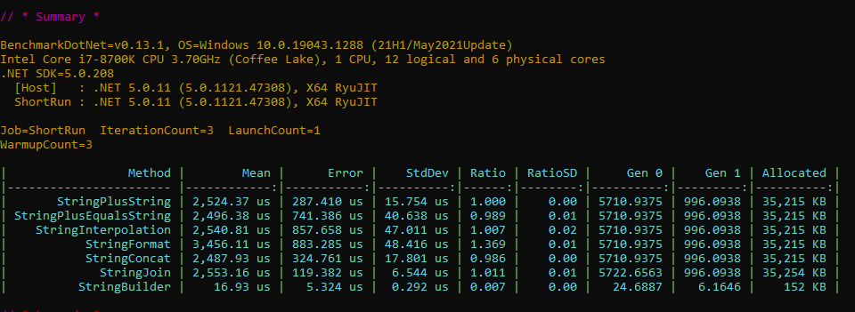

Jump to the [script](Program.cs).

# Benchmark results

|                 Method |        Mean |      Error |    StdDev | Ratio | RatioSD |     Gen 0 |    Gen 1 | Allocated |
|----------------------- |------------:|-----------:|----------:|------:|--------:|----------:|---------:|----------:|
|             StringPlus | 2,524.37 us | 287.410 us | 15.754 us | 1.000 |    0.00 | 5710.9375 | 996.0938 | 35,215 KB |
|       StringPlusEquals | 2,496.38 us | 741.386 us | 40.638 us | 0.989 |    0.01 | 5710.9375 | 996.0938 | 35,215 KB |
|    StringInterpolation | 2,540.81 us | 857.658 us | 47.011 us | 1.007 |    0.02 | 5710.9375 | 996.0938 | 35,215 KB |
|           StringFormat | 3,456.11 us | 883.285 us | 48.416 us | 1.369 |    0.01 | 5710.9375 | 996.0938 | 35,215 KB |
|           StringConcat | 2,487.93 us | 324.761 us | 17.801 us | 0.986 |    0.00 | 5710.9375 | 996.0938 | 35,215 KB |
|             StringJoin | 2,553.16 us | 119.382 us |  6.544 us | 1.011 |    0.01 | 5722.6563 | 996.0938 | 35,254 KB |
|          StringBuilder |    16.93 us |   5.324 us |  0.292 us | 0.007 |    0.00 |   24.6887 |   6.1646 |    152 KB |

